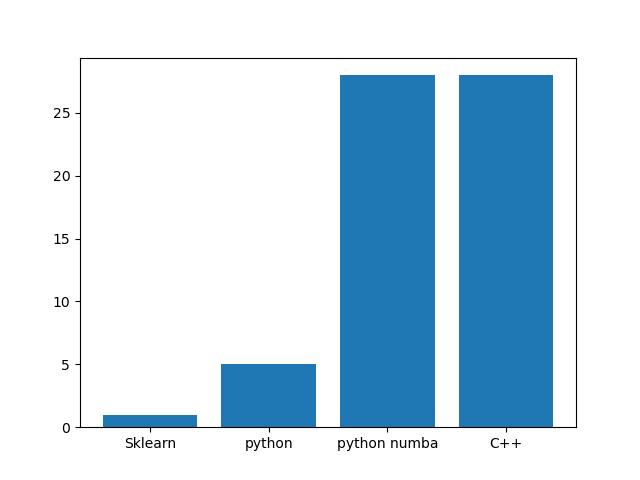

# fastauc

Three fast AUC calculation implementations for python:

python-based is approximately 5X faster than the default sklearn.metrics.roc_auc_score()

Python numba based is approximately 28X faster than the default sklearn.metrics.roc_auc_score()

C++/ctypes based is approximately 29X faster than the default sklearn.metrics.roc_auc_score()

NB: run cd fastauc && ./compile.sh to create a binary before you use a C++ version.

See demo.py for speed benchmark and usage examples.